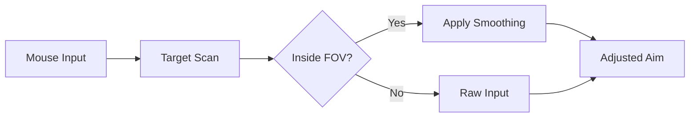

# PAYDAY 2 Aim Assist

When the alarm screams, subtlety dies—and rhythm takes over. In **PAYDAY 2**, loud heists are storms of shields, cloakers, and endless waves pressing from every angle. In that chaos, accuracy isn’t about twitch reflexes alone. It’s about control.

The **PAYDAY 2 Aim Assist** is a precision-focused PC module built to steady your hand without stealing the moment. Not a harsh snap. Not a robotic lock. Just enough guidance to let intent flow cleanly from thought to trigger.

---

## 🧠 Overview

Designed for **PAYDAY 2**, this aim assist system works live and dynamically, smoothing micro-movements and stabilizing tracking during high-pressure engagements.

Its quiet principles:

* Assist aim, don’t replace it
* Preserve recoil identity
* Stay human under fire

Whether you’re holding a choke point, clearing a hallway, or cutting through a dozer’s visor, the system adapts to your pace.

---

## 🎯 Core Aim Modules

### 🔒 Soft Aim Assist

* Adjustable magnetism strength
* FOV-based activation radius
* Bone targeting (head / torso / adaptive)
* Distance-scaled assistance

### 🌀 Tracking Stabilization

* Smooth follow for moving targets
* Horizontal & vertical micro-correction
* ADS-only mode for realism
* Weapon-specific sensitivity profiles

> [!NOTE]
> Low values feel natural—like steadier nerves. Higher values are best reserved for testing or chaotic holdouts.

---

## 🔫 Weapon Handling Enhancements

Loud fights punish recoil more than aim.

* Recoil dampening with sliders
* Spray stabilization for ARs & LMGs
* Fire-rate smoothing
* Scope sensitivity balancing

Each weapon class keeps its personality—just fewer wasted bullets.


---

## ⚙ Setup & Calibration

Fast setup. Fine tuning.

1. Launch **PAYDAY 2**
2. Run the Aim Assist as administrator
3. Wait for attachment confirmation
4. Open the control panel via hotkey
5. Adjust strength, FOV, and smoothing

Example bindings:

```text
INSERT – Open / Close Menu
F1     – Aim Assist Toggle
F2     – Recoil Control
F3     – Assist Strength +
F4     – Assist Strength -
F5     – Profile Switch
```

> [!IMPORTANT]
> Always calibrate during a low-risk heist or offline session before relying on it in loud play.

---

## 🔄 How the Assist Behaves (Conceptual)



The assist follows your decision—it never decides for you.

---

## ❓ FAQ

**Is this a hard aimbot?**
No. It’s a soft aim assist focused on smoothing and stabilization.

**Can I keep it subtle?**
Yes. Low-strength settings blend naturally with manual aim.

**Does it work with all weapons?**
Weapon-class profiles allow tailored behavior for SMGs, ARs, LMGs, and snipers.

**Will it affect FPS or input lag?**
Optimized for minimal overhead and fast response.

**Is this useful for learning loud builds?**
Many players use it to understand recoil patterns and crowd control timing.

---

## 🌒 Final Thoughts

Loud heists aren’t graceful—they’re relentless. The **PAYDAY 2 Aim Assist** doesn’t make you unstoppable. It makes you steadier, calmer, more deliberate when the sirens peak and the ammo runs thin.

Breathe.
Track.
Fire true.
